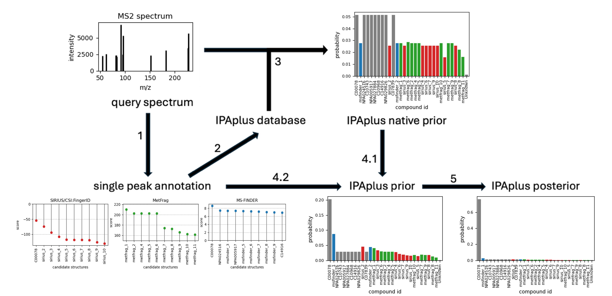

# IPAplus

### Motivation: 
Metabolomics is established in biomedical research, aiming to characterise the com-position and functions of metabolites within biological systems. Mass spectrometry methods play a crucial role. Methods for annotating a single spectral peak have seen significant development, however spectral annotation of mixtures remains challenging. Probabilistic frameworks like Inte-grated Probabilistic Annotation ([IPA]([https://github.com/theisraelolaleye](https://github.com/francescodc87/ipaPy2)))leverage database scoring and contextual information to im-prove annotations, but are hindered by limited native databases and assumptions. Single-peak an-notation tools can provide complementary, additional method-specific identifications. 
### Results: 
IPA is a Bayesian tool for estimating the posterior probabilities of the presence of metabo-lites in a particular sample given the MS data. Here, we extend the previous generic IPA pipeline using a systematic and rigorous integration of multiple single-peak annotation methods. We opti-mised different likelihood functions to achieve a Bayesian explainable integration from different sin-gle-peak annotation methods, testing three state-of-the-art single-peak identification tools, SIRIUS, MetFrag and MS-FINDER. The novel integrated IPAplus pipeline adds new compounds to the da-tabase and leads to more confident and plausible annotations, as well as a general framework for incorporating further sources of evidence and unifying the diverse toolset of metabolome annotation. 

